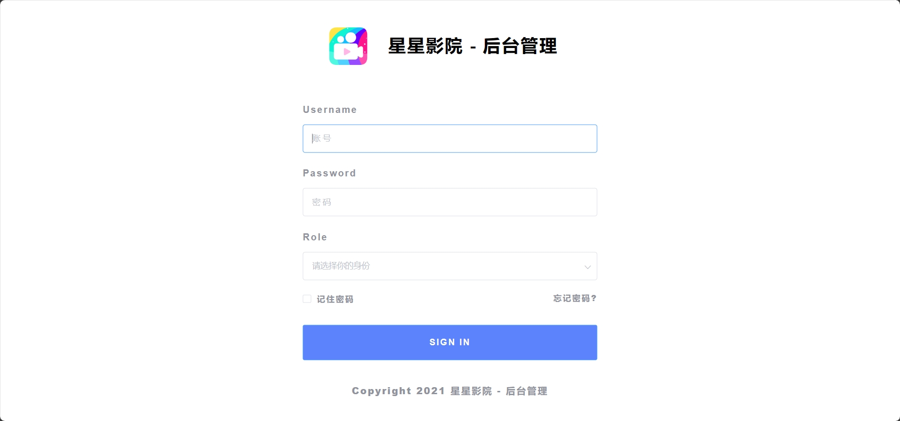
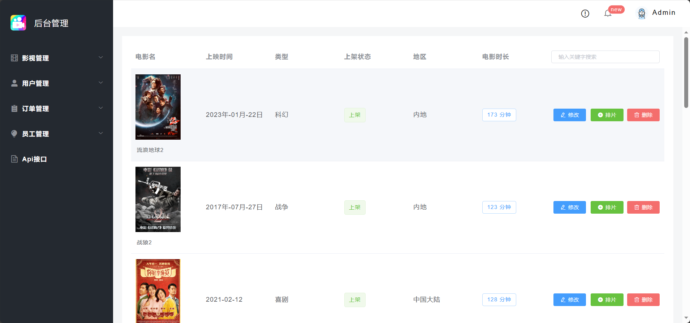
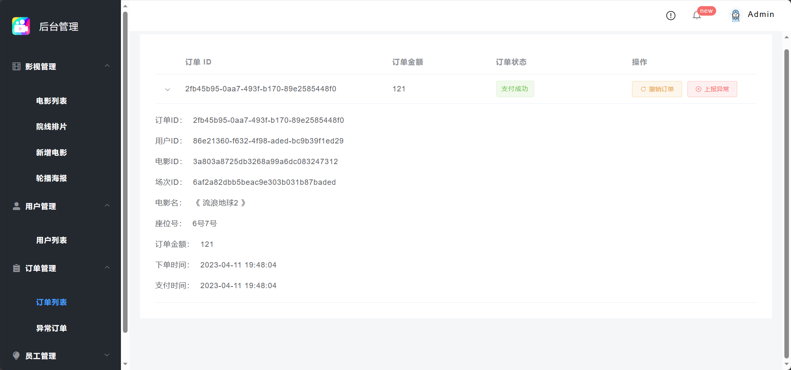
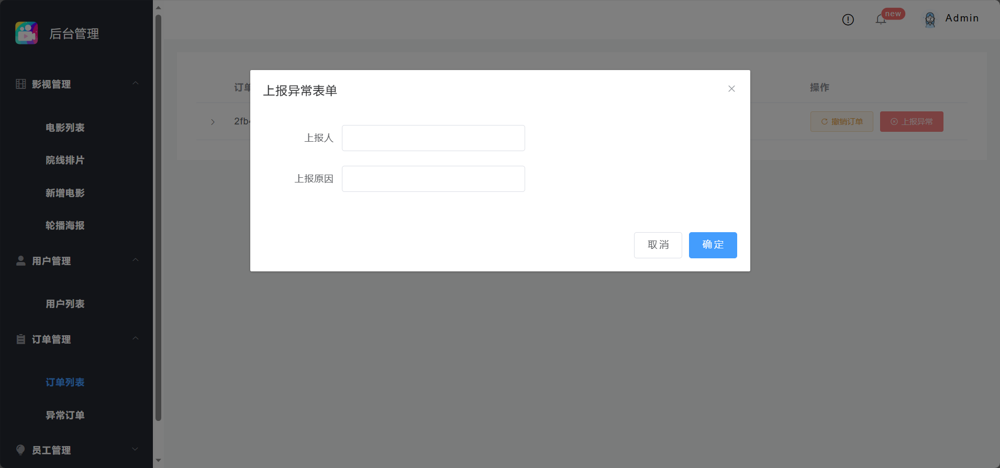
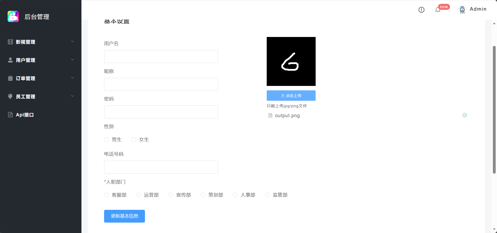
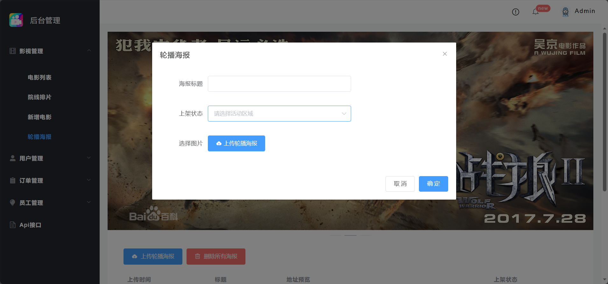
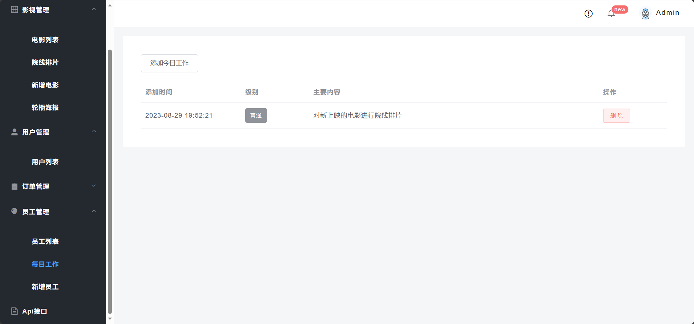

<h1 align="center">基于SpringBoot的影院管理系统</h1>

<h4> 完整代码获取地址：从戎源码网（https://armycodes.com/） </h4>
<h4> 作者微信：19941326836 QQ：605739993 QQ群：655392706 </h4>
<h4> 承接计算机毕设、Java毕业设计、Python毕业设计、深度学习、机器学习 </h4>
<h4> 选题+开题报告+任务书+程序定制+安装调试+论文+答辩ppt 一条龙服务 </h4>
<h4> 毕业设计所有选题地址：(https://github.com/Descartes007/allProject) </h4>

## 一、项目介绍

基于SpringBoot的影院管理系统：前端 Vue、ElementUI，后端 SpringBoot、Redis、Mybatis，系统角色分为：管理员、员工和用户，管理员在管理后台管理电影，对海报进行发布，添加新管理员等；员工对消息进行回复、活动发布等；用户根据发布的电影选座观看等。主要功能如下：

### 1、管理员：

- 基本操作：注册、登录、完善个人信息、获取个人信息
- 影视管理：获取电影列表、修改电影信息、电影排片、删除电影、筛选电影、新增电影信息
- 海报管理：发布轮播海报、删除海报、下架海报
- 用户管理：获取用户列表、修改用户密码
- 订单管理：获取订单列表、获取订单细则、撤销订单、上报订单异常、获取异常订单列表、处理异常订单
- 员工管理：获取员工列表、查看员工权限、添加权限、删除员工、发布每日工作、新增员工
- API接口：查看系统中各个端的后端接口字段及参数

### 2、员工：

- 基本操作：注册、登录、完善个人信息、查看个人信息
- 活动模块：发布活动、获取活动列表、删除活动
- 留言模块：回复留言、获取留言列表
- 其他模块：获取评价列表、获取订单列表、获取用户活跃程度列表、查看每日工作

### 3、用户：

- 基本操作：登录、注册、修改个人信息、查看基本资料
- 电影模块：获取电影列表、查看电影信息详情、筛选电影、选座订票、电影评分、加入购物车
- 订单模块：查看历史订单
- 活动模块：参加活动、获取活动列表
- 其他模块：留言、客服评价、查看我的评价

## 二、环境

- <b>IntelliJ IDEA 2020.3</b>

- <b>Mysql 5.7.26</b>

- <b>NodeJs 14.17.3</b>

- <b>Redis 3.2.100</b>

- <b>Maven 3.6.3</b>

- <b>JDK 1.8</b>

## 三、运行截图

